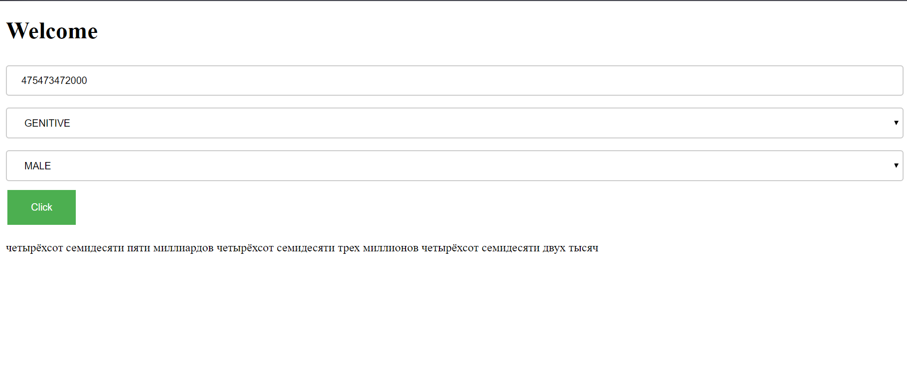

# Тестовое задание

Создание функции для преобразования целого числа в строку прописью.
Для удобного тестирования было создано простое веб приложение

## Getting Started

Выполните в консоли:
```
mvn package
```
Затем 
```
java -jar testInvestBank-1.0-Snapshot.jar
```

Перейдите по адресу: localhost:8080

## How to
1. Введите целое число в диапозоне от -999,999,999,999 до 999,999,999,999
2. Выберите падеж и род
3. Нажмите "Click"
!
